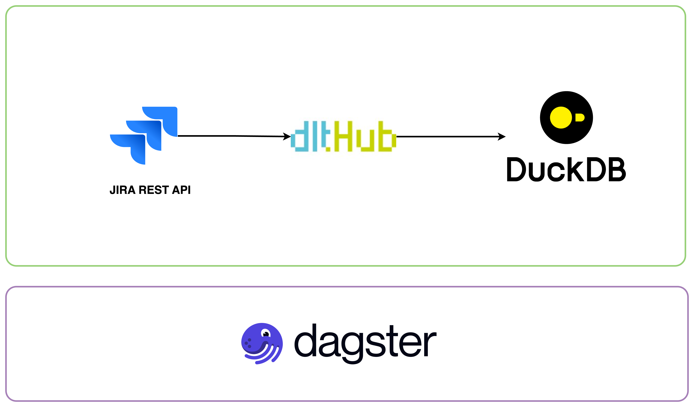
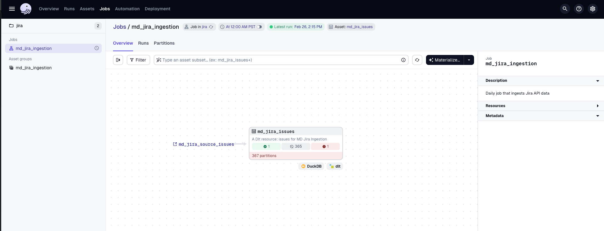
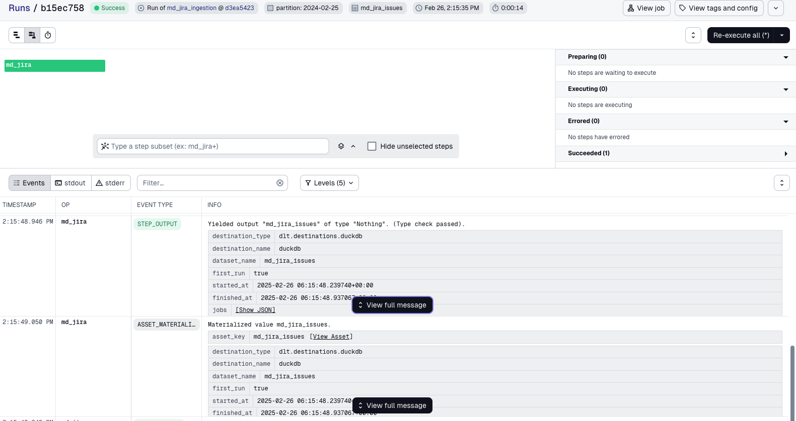
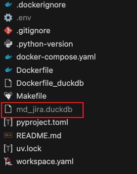
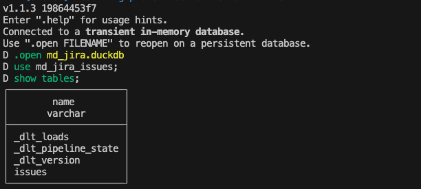
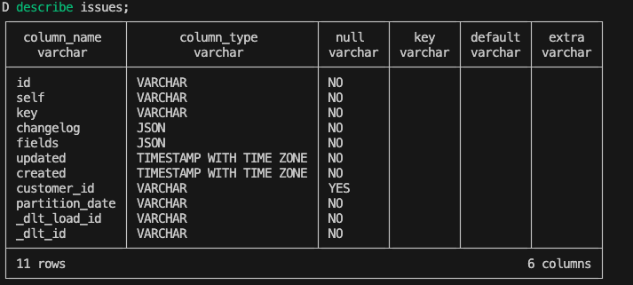

# Loading Jira API to DuckDb using dlt and Dagster



## Overview

This project demonstrates a data pipeline that extracts JIRA issue data via REST API and loads it into DuckDB using [**dlt**](https://dlthub.com/) and [**Dagster**](https://dagster.io/). The pipeline performs daily batch ingestion by leveraging key features of both tools:

* **dlt's REST API to streamline endpoint configuration, pagination, and authentication**
* **Merge write disposition for incremental loading**
* **Dagster partitioning to dynamically handle incremental loading and backfilling**
* **Enforces schema contract through Pydantic data validation**

## Prerequisites

Before starting, ensure you have these prerequisites installed:
* docker

## Project Structure 

```
├── .dlt
│   ├── config.toml
│   ├── secrets.toml
├── Dockerfile
├── Dockerfile_duckdb
├── Makefile
├── README.md
├── docker-compose.yaml
├── jira
│   ├── __init__.py
│   ├── assets.py
│   ├── definitions.py
│   ├── dlt
│   │   └── sources
│   │       ├── md.py
│   │       └── models
│   │           ├── __init__.py
│   │           └── md_jira_issues_model.py
│   ├── jobs.py
│   ├── partitions.py
│   ├── schedules.py
│   └── utils
│       └── jira_utils.py
├── pyproject.toml
├── uv.lock
├── workspace.yaml
├── .dockerignore
├── .gitignore
├── .python-version
```

## Environment Variables

Add the following environment variables to your `.env` file:

```bash
JIRA_USERNAME=<your jira username>
JIRA_ACCESS_TOKEN=<your jira access token>
```

## Run Locally

> Before running locally, update the `base_url` in the `client` configuration with your JIRA API endpoint domain at `jira/dlt/sources/md.py`

### Running on Dagster

To start a Dagster instance, run:

```bash
make dagster
```

Upon launching the Dagster UI, a single code location is loaded containing the `md_jira_ingestion_job`. When materializing this partitioned job, you'll select a partition date for the dlt asset to extract and incrementally load JIRA API data.



A successful run outputs dlt-related metadata on the Dagster logs:



By default, a DuckDB database will be created in the current working directory with a name `<pipeline_name>.duckdb`. Since the defined pipeline name in this project is 'md_jira', a database named `md_jira.duckdb` is created as shown below:

<p align="center">
  
</p>

### Running SQL queries on Duckdb

To explore the loaded data, open a new terminal and run:

```bash
make duckdb
```

This opens a DuckDB CLI where you can run SQL queries to explore and verify the loaded JIRA API data on the generated duckdb.



The Jira API data extracted and normalized is loaded on the `issues` table with the following schema:

